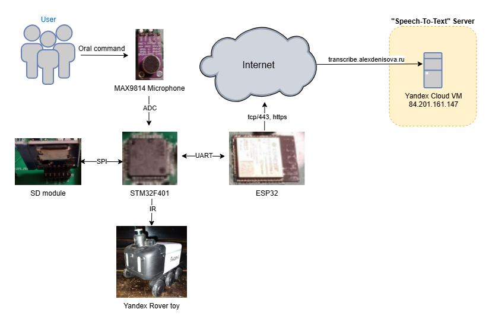
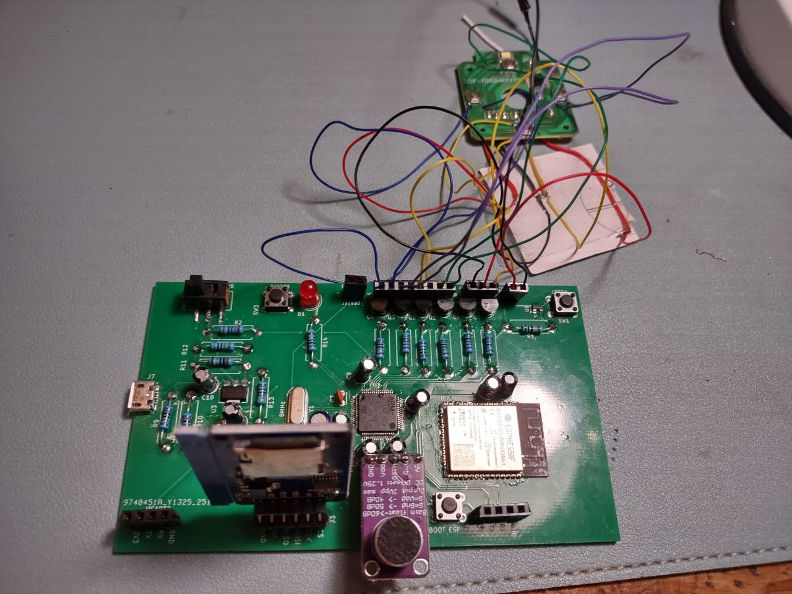
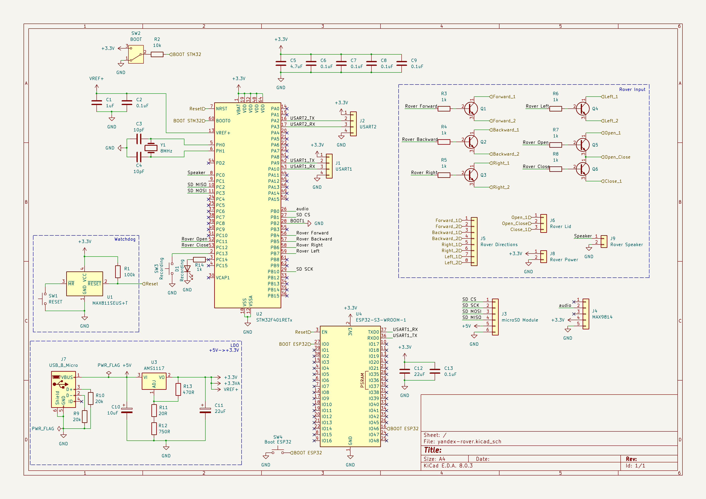
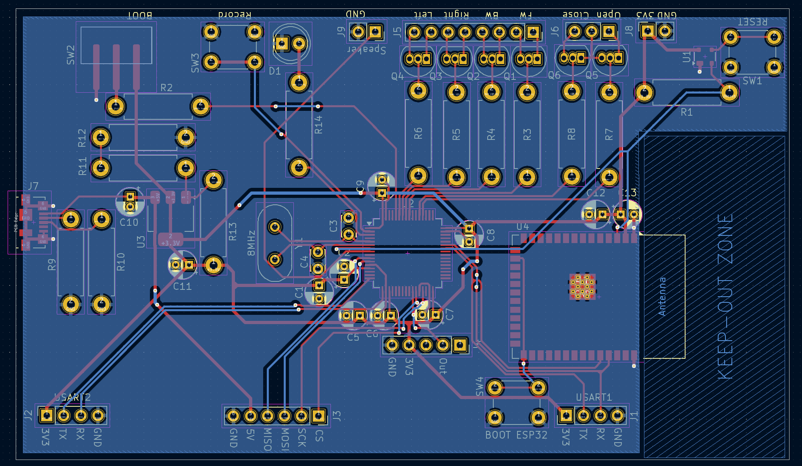
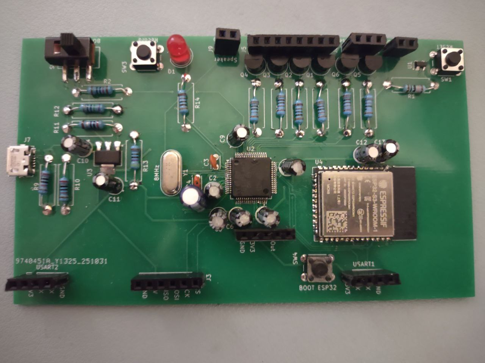

# Rover

An STM32 + ESP32 remote controller for a Yandex Rover toy that executes voice commands: "Forward", "Backward", "Right", "Left", "Spin", "Open", "Close".

As OpenAI's Whisper is rather slow at transcribing the audio, it takes several seconds for the rover to react to the oral command. In the future, I plan to train my own speech-to-text model in the hopes of making it quicker.

## How it works

The user says one of the commands, which is recorded by the MAX9814 microphone either onto the SD card or to the ESP32. The ESP32 creates a WAV file from the audio and sends it to the "Speech-to-Text" server that uses OpenAI's Whisper to transcribe the audio. Then, based on the command received, the STM32 sends an IR signal to the rover, who then completes the command.

## Video

In the demonstration, I give the command "Forward". The rover takes several seconds to react, as the speech-to-text model is rather slow at transcribing.

## Photos

    
    
    

